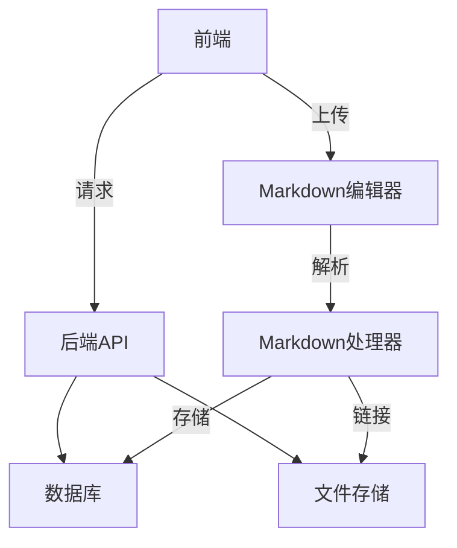

# 基本设计
## 系统架构



## 页面组件设计

### 布局组件

```
// Layout.jsx
export default function Layout({ children }) {
  return (
    <div className="min-h-screen flex flex-col bg-white dark:bg-gray-900 transition-colors duration-300">
      <Navbar />
      <main className="flex-grow container mx-auto px-4 py-6">
        {children}
      </main>
      <Footer />
      <MusicPlayer />
      <WeatherWidget />
    </div>
  );
}
```

### 导航栏组件

```
// Navbar.jsx
export default function Navbar() {
  return (
    <nav className="sticky top-0 z-50 bg-white/80 dark:bg-gray-800/80 backdrop-blur-sm shadow-md">
      <div className="container mx-auto px-4 py-3 flex justify-between items-center">
        <div className="flex items-center space-x-4">
          <Avatar />
          <SiteTitle />
        </div>
        
        <div className="hidden md:flex space-x-6">
          <NavLink to="/">首页</NavLink>
          <NavLink to="/categories">分类</NavLink>
          <NavLink to="/tags">标签</NavLink>
          <NavLink to="/timeline">时间线</NavLink>
          <NavLink to="/about">关于</NavLink>
        </div>
        
        <div className="flex items-center space-x-4">
          <SearchBar />
          <DarkModeToggle />
        </div>
        
        <MobileMenuButton />
      </div>
      
      <MobileMenu />
    </nav>
  );
}
```

### 主页组件

```
// HomePage.jsx
export default function HomePage() {
  const { articles, isLoading } = useLatestArticles();
  
  return (
    <div>
      <HeroSection />
      
      <div className="grid grid-cols-1 lg:grid-cols-3 gap-8 mt-12">
        <div className="lg:col-span-2">
          <SectionTitle>最新文章</SectionTitle>
          {isLoading ? <ArticleSkeleton count={3} /> : (
            articles.map(article => (
              <ArticleCard key={article.id} article={article} />
            ))
          )}
        </div>
        
        <div className="lg:col-span-1 space-y-8">
          <MottoWidget />
          <CalendarWidget />
          <PopularArticles />
          <CategoriesWidget />
        </div>
      </div>
    </div>
  );
}
```

### Markdown编辑器组件

```
// MarkdownEditor.jsx
export default function MarkdownEditor({ onSave }) {
  const [markdown, setMarkdown] = useState('');
  const [preview, setPreview] = useState(false);
  
  const handleImageUpload = async (file) => {
    try {
      const imageUrl = await uploadImage(file);
      const markdownImage = ``;
      setMarkdown(prev => `${prev}\n${markdownImage}\n`);
    } catch (error) {
      console.error('图片上传失败:', error);
    }
  };
  
  const handleSave = () => {
    const htmlContent = renderMarkdown(markdown);
    onSave({ markdown, htmlContent });
  };
  
  return (
    <div className="border rounded-lg overflow-hidden">
      <div className="editor-toolbar bg-gray-100 p-2 flex flex-wrap gap-2">
        <button onClick={() => setPreview(false)} className={!preview ? 'font-bold' : ''}>
          编辑
        </button>
        <button onClick={() => setPreview(true)} className={preview ? 'font-bold' : ''}>
          预览
        </button>
        <ImageUploadButton onUpload={handleImageUpload} />
        <button onClick={handleSave} className="ml-auto bg-blue-600 text-white px-4 py-1 rounded">
          发布
        </button>
      </div>
      
      {preview ? (
        <div 
          className="p-4 prose max-w-none dark:prose-invert"
          dangerouslySetInnerHTML={{ __html: renderMarkdown(markdown) }}
        />
      ) : (
        <textarea
          value={markdown}
          onChange={(e) => setMarkdown(e.target.value)}
          className="w-full h-96 p-4 font-mono text-sm focus:outline-none"
          placeholder="开始写作..."
        />
      )}
    </div>
  );
}
```

## 核心功能实现

### Markdown处理模块

```
// markdownUtils.js
import { marked } from 'marked';
import DOMPurify from 'dompurify';
import hljs from 'highlight.js';

// 配置Markdown解析器
marked.setOptions({
  highlight: (code, lang) => {
    const language = hljs.getLanguage(lang) ? lang : 'plaintext';
    return hljs.highlight(code, { language }).value;
  },
  langPrefix: 'hljs language-',
});

// 渲染Markdown为HTML
export const renderMarkdown = (raw) => {
  const html = marked.parse(raw);
  return DOMPurify.sanitize(html);
};

// 生成目录结构
export const generateTOC = (html) => {
  const parser = new DOMParser();
  const doc = parser.parseFromString(html, 'text/html');
  const headings = [];
  
  doc.querySelectorAll('h1, h2, h3, h4').forEach((el) => {
    if (!el.id) el.id = `heading-${Math.random().toString(36).substr(2, 9)}`;
    
    headings.push({
      id: el.id,
      text: el.textContent || '',
      level: parseInt(el.tagName.substring(1))
    });
  });
  
  return headings;
};

// 图片URL处理
export const processImageUrls = (markdown) => {
  return markdown.replace(/!\[(.*?)\]\((.*?)\)/g, (match, alt, src) => {
    if (!src.startsWith('http') {
      return ``;
    }
    return match;
  });
};
```

### 文章服务模块

```
// articleService.js
import { renderMarkdown, generateTOC } from './markdownUtils';

// 创建文章
export const createArticle = async (articleData) => {
  const processedMarkdown = processImageUrls(articleData.markdown);
  const htmlContent = renderMarkdown(processedMarkdown);
  const toc = generateTOC(htmlContent);
  
  const article = {
    ...articleData,
    markdown: processedMarkdown,
    htmlContent,
    toc: JSON.stringify(toc),
    createdAt: new Date(),
    updatedAt: new Date(),
    views: 0,
  };
  
  // 保存到数据库
  return await db.article.create(article);
};

// 获取文章详情
export const getArticle = async (id) => {
  const article = await db.article.findUnique({ where: { id } });
  if (!article) return null;
  
  // 增加阅读量
  await db.article.update({
    where: { id },
    data: { views: { increment: 1 } }
  });
  
  return {
    ...article,
    toc: JSON.parse(article.toc)
  };
};

// 响应式目录处理
export const getResponsiveTOC = (toc, screenWidth) => {
  if (screenWidth < 768) return [];
  return toc.filter(item => item.level <= 3);
};
```

### 文件上传服务

```
// fileService.js
import fs from 'fs/promises';
import path from 'path';
import { v4 as uuidv4 } from 'uuid';

const UPLOAD_DIR = process.env.UPLOAD_DIR || './public/uploads';

// 确保上传目录存在
const ensureUploadDir = async () => {
  try {
    await fs.access(UPLOAD_DIR);
  } catch {
    await fs.mkdir(UPLOAD_DIR, { recursive: true });
  }
};

// 保存Markdown图片
export const saveMarkdownImage = async (file) => {
  await ensureUploadDir();
  
  const ext = path.extname(file.originalname);
  const filename = `${uuidv4()}${ext}`;
  const filepath = path.join(UPLOAD_DIR, filename);
  
  await fs.writeFile(filepath, file.buffer);
  return `/uploads/${filename}`;
};

// 删除未使用的图片
export const cleanupUnusedImages = async () => {
  // 实现逻辑：定期扫描图片目录，删除未被任何文章引用的图片
};
```

## 特色功能实现

### 响应式目录组件

```
// TableOfContents.jsx
export default function TableOfContents({ toc, activeId }) {
  const { isMobile } = useResponsive();
  
  if (isMobile || !toc.length) return null;
  
  return (
    <div className="sticky top-24 ml-8 hidden lg:block w-64">
      <div className="text-lg font-semibold mb-3">目录</div>
      <ul className="space-y-1 border-l-2 border-gray-200 dark:border-gray-700 pl-4">
        {toc.map((item) => (
          <li 
            key={item.id}
            className={`pl-2 py-1 hover:text-blue-600 transition-colors ${
              item.id === activeId 
                ? 'text-blue-600 font-medium' 
                : 'text-gray-600 dark:text-gray-400'
            }`}
            style={{ marginLeft: `${(item.level - 2) * 12}px` }}
          >
            <a href={`#${item.id}`}>{item.text}</a>
          </li>
        ))}
      </ul>
    </div>
  );
}
```

### 天气组件

```
// WeatherWidget.jsx
export default function WeatherWidget() {
  const [weather, setWeather] = useState(null);
  const [loading, setLoading] = useState(true);
  
  useEffect(() => {
    const fetchWeather = async () => {
      try {
        const position = await getGeolocation();
        const data = await fetchWeatherData(position.coords);
        setWeather(data);
      } catch (error) {
        console.error('获取天气失败:', error);
      } finally {
        setLoading(false);
      }
    };
    
    fetchWeather();
  }, []);
  
  if (loading) return <div className="text-sm">加载天气中...</div>;
  if (!weather) return null;
  
  return (
    <div className="flex items-center text-sm bg-gray-100 dark:bg-gray-800 rounded-lg p-3">
      <WeatherIcon condition={weather.condition} />
      <div className="ml-2">
        <div>{weather.location}</div>
        <div className="font-medium">{weather.temp}°C | {weather.condition}</div>
      </div>
    </div>
  );
}
```

### 音乐播放器组件

```
// MusicPlayer.jsx
export default function MusicPlayer() {
  const [isPlaying, setIsPlaying] = useState(false);
  const [volume, setVolume] = useState(0.5);
  
  const togglePlay = () => {
    setIsPlaying(!isPlaying);
  };
  
  return (
    <div className="fixed bottom-4 right-4 z-50">
      <div className="bg-white dark:bg-gray-800 rounded-full shadow-lg p-3 flex items-center">
        <button 
          onClick={togglePlay}
          className="w-8 h-8 flex items-center justify-center rounded-full bg-gray-200 dark:bg-gray-700"
        >
          {isPlaying ? <PauseIcon /> : <PlayIcon />}
        </button>
        
        {isPlaying && (
          <div className="ml-3 flex items-center">
            <VolumeDownIcon className="text-gray-500" />
            <input 
              type="range" 
              min="0" 
              max="1" 
              step="0.01"
              value={volume}
              onChange={(e) => setVolume(parseFloat(e.target.value))}
              className="w-20 mx-2"
            />
            <VolumeUpIcon className="text-gray-500" />
          </div>
        )}
      </div>
    </div>
  );
}
```

## 响应式设计

```
/* 全局响应式变量 */
:root {
  --font-body: 'Inter', system-ui, sans-serif;
  --font-code: 'JetBrains Mono', monospace;
  --spacing-xs: 0.5rem;
  --spacing-sm: 0.75rem;
  --spacing-md: 1rem;
  --spacing-lg: 1.5rem;
  --spacing-xl: 2rem;
  --radius-sm: 4px;
  --radius-md: 8px;
  --radius-lg: 12px;
  --transition: 0.2s ease;
}

@media (max-width: 768px) {
  :root {
    --spacing-xs: 0.25rem;
    --spacing-sm: 0.5rem;
    --spacing-md: 0.75rem;
    --spacing-lg: 1rem;
    --spacing-xl: 1.5rem;
  }
}

/* 响应式布局 */
.article-container {
  display: grid;
  grid-template-columns: 1fr;
  gap: var(--spacing-xl);
  
  @media (min-width: 1024px) {
    grid-template-columns: minmax(0, 1fr) 300px;
  }
}

.article-content {
  max-width: 100%;
  overflow-x: auto;
  
  pre {
    border-radius: var(--radius-md);
    padding: var(--spacing-md);
    overflow-x: auto;
    font-family: var(--font-code);
    font-size: 0.9em;
  }
  
  img {
    max-width: 100%;
    height: auto;
    border-radius: var(--radius-md);
  }
}
```

## 性能优化策略

```
// 图片懒加载实现
export const lazyLoadImages = () => {
  const images = document.querySelectorAll('img[data-src]');
  const observer = new IntersectionObserver((entries) => {
    entries.forEach(entry => {
      if (entry.isIntersecting) {
        const img = entry.target;
        img.src = img.dataset.src;
        img.removeAttribute('data-src');
        observer.unobserve(img);
      }
    });
  }, { rootMargin: '200px' });
  
  images.forEach(img => observer.observe(img));
};

// Markdown分块处理
export const processLargeMarkdown = (markdown) => {
  const CHUNK_SIZE = 5000;
  let result = '';
  
  for (let i = 0; i < markdown.length; i += CHUNK_SIZE) {
    const chunk = markdown.substring(i, i + CHUNK_SIZE);
    result += renderMarkdown(chunk);
  }
  
  return result;
};

// 服务端渲染优化
export const getStaticProps = async () => {
  const articles = await getLatestArticles(5);
  const popular = await getPopularArticles(3);
  
  return {
    props: {
      articles,
      popular
    },
    revalidate: 60 * 60 // 每60分钟重新生成
  };
};
```

## **总结**

这个博客系统设计包含以下核心特点：

1.  **完整的Markdown处理流程**：
    
    *   支持图片上传与存储
    *   Markdown解析与渲染
    *   自动生成目录结构
2.  **响应式设计**：
    
    *   多端适配布局
    *   设备感知组件
    *   响应式目录系统
3.  **特色功能**：
    
    *   天气组件
    *   音乐播放器
    *   动态日历
    *   座右铭展示
4.  **性能优化**：
    
    *   图片懒加载
    *   分块处理大文档
    *   静态生成与增量更新
5.  **用户体验增强**：
    
    *   平滑过渡动画
    *   暗黑模式切换
    *   交互式标签云

实现时建议遵循以下步骤：

1.  先构建核心内容管理系统（编辑器+解析器+数据库）
2.  实现基础页面布局和导航
3.  添加文章展示和分类功能
4.  实现特色组件（天气、音乐等）
5.  进行响应式优化和性能调优
6.  添加动画和交互效果