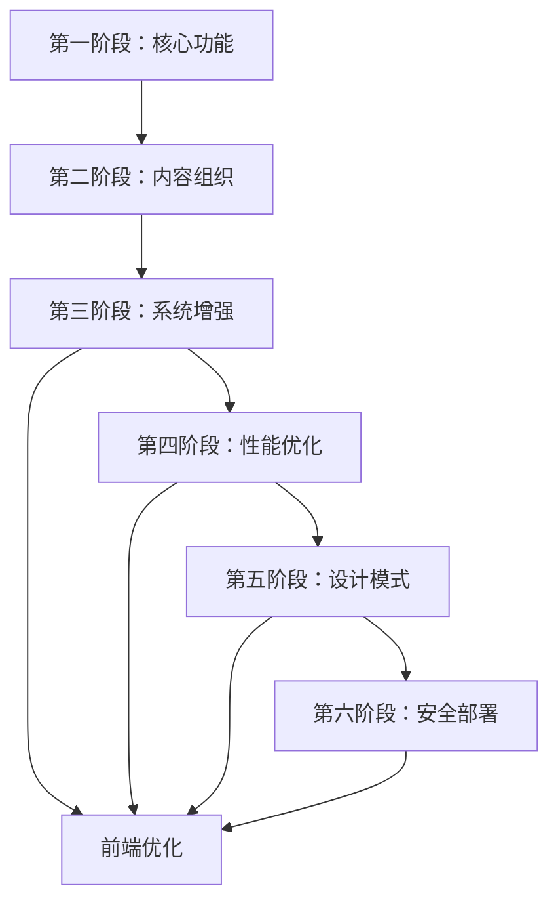

# 开发计划
## 博客系统开发阶段划分与实现内容

根据前后端设计，我将整个开发过程划分为六个阶段，每个阶段聚焦核心功能并逐步扩展优化：

## 第一阶段：核心功能实现（2-3周）

### 目标：建立基础内容管理功能

*   **后端实现**：
    
    1.  文章模型（Article）核心字段实现
    2.  Markdown处理流水线（存储、渲染、TOC生成）
    3.  基础CRUD API：
        *   GET /api/articles/ (列表)
        *   POST /api/articles/ (创建)
        *   GET /api/articles/{id}/ (详情)
    4.  图片上传接口（/api/upload/image/）
*   **前端实现**：
    
    1.  基础布局框架（Header/Footer）
    2.  文章列表页（Home）
    3.  文章详情页（ArticleDetail）
    4.  Markdown编辑器组件（创建/编辑文章）
    5.  简单路由系统

### 交付成果：

*   用户可创建、查看、编辑文章
*   支持Markdown写作和图片上传
*   基础文章展示能力

## 第二阶段：内容组织与发现（1-2周）

### 目标：实现内容分类和导航

*   **后端实现**：
    
    1.  分类模型（Category）和标签模型（Tag）
    2.  分类和标签关联文章
    3.  API扩展：
        *   GET /api/categories/
        *   GET /api/tags/
        *   GET /api/categories/{slug}/articles/
        *   GET /api/tags/{slug}/articles/
    4.  时间线API（/api/timeline/）
*   **前端实现**：
    
    1.  分类页面（Category）
    2.  标签页面（Tag）
    3.  时间线页面（Timeline）
    4.  文章卡片组件（ArticleCard）
    5.  导航菜单完善

### 交付成果：

*   内容可按分类/标签浏览
*   时间线视图展示文章历史
*   增强内容发现能力

## 第三阶段：系统增强与个性化（1-2周）

### 目标：添加系统特性和用户个性化

*   **后端实现**：
    
    1.  站点设置模型（SiteSetting）
    2.  页面管理（Page）
    3.  友链管理（FriendLink）
    4.  API扩展：
        *   GET /api/settings/
        *   GET /api/pages/{page\_type}/
        *   GET /api/friendlinks/
    5.  天气API（/api/weather/）
*   **前端实现**：
    
    1.  关于页面（About）
    2.  友链页面（FriendLinks）
    3.  天气组件（WeatherWidget）
    4.  音乐播放器（MusicPlayer）
    5.  暗黑模式切换
    6.  座右铭展示

### 交付成果：

*   完整站点信息展示
*   个性化功能（主题、音乐）
*   第三方服务集成（天气）

## 第四阶段：性能优化（1周）

### 目标：提升系统响应速度和用户体验

*   **后端优化**：
    
    1.  数据库查询优化（select\_related/prefetch\_related）
    2.  缓存机制（Redis缓存热门数据）
    3.  分页支持
    4.  异步任务（Celery处理图片压缩）
    5.  Gzip压缩响应
*   **前端优化**：
    
    1.  图片懒加载
    2.  组件按需加载
    3.  资源压缩（CSS/JS minify）
    4.  骨架屏加载效果
    5.  前端缓存策略

### 交付成果：

*   页面加载速度提升50%+
*   数据库查询减少60%+
*   流畅的用户体验

## 第五阶段：设计模式重构（1周）

### 目标：提高代码可维护性和扩展性

*   **模式实现**：
    
    1.  单例模式（SiteSettings服务）
    2.  策略模式（存储策略：本地/S3）
    3.  观察者模式（文章发布通知）
    4.  工厂模式（Markdown处理器）
    5.  装饰器模式（缓存装饰器）
*   **重构重点**：
    
    1.  解耦图片上传处理
    2.  抽象Markdown渲染流程
    3.  通知系统插件化
    4.  配置驱动存储策略

### 交付成果：

*   可扩展的架构
*   更易维护的代码库
*   支持多种存储方案

## 第六阶段：安全与部署（1周）

### 目标：确保系统安全并上线运行

*   **安全加固**：
    
    1.  XSS防护（Markdown输出清理）
    2.  CSRF保护
    3.  文件上传验证
    4.  API限流
    5.  敏感数据保护
*   **部署准备**：
    
    1.  Docker容器化
    2.  生产环境配置
    3.  CI/CD流水线
    4.  监控与日志（Sentry, Loggly）
    5.  备份策略
*   **前端优化**：
    
    1.  SEO优化（Meta标签）
    2.  PWA支持
    3.  错误边界处理
    4.  性能分析（Lighthouse）

### 交付成果：

*   安全的生产环境
*   自动化部署流程
*   完整的监控体系

## 阶段间依赖关系

## 迭代开发建议

1.  **敏捷开发**：
    
    *   每阶段2周迭代
    *   每周发布可演示版本
    *   持续收集用户反馈
2.  **技术选型**：
    
    *   前端：Vue3 + Pinia + Vite
    *   后端：Django + Django REST Framework
    *   数据库：PostgreSQL
    *   缓存：Redis
    *   搜索：Elasticsearch（可选扩展）
3.  **优先度调整**：
    
    *   核心功能 > 性能优化 > 设计模式
    *   移动端适配贯穿所有阶段
    *   安全措施尽早实施
4.  **测试策略**：
    
    *   单元测试（核心业务逻辑）
    *   集成测试（API端点）
    *   E2E测试（关键用户流程）
    *   性能测试（高并发场景）

## 风险控制

1.  **技术风险**：
    
    *   Markdown复杂内容渲染问题（早期原型验证）
    *   大文件上传稳定性（分块上传方案备选）
2.  **范围蔓延**：
    
    *   冻结阶段需求（除关键缺陷外）
    *   非核心功能放入"二期优化"列表
3.  **性能瓶颈**：
    
    *   早期实施监控
    *   压力测试提前介入
    *   设计水平扩展方案
4.  **依赖风险**：
    
    *   封装天气API调用
    *   提供模拟数据回退方案
    *   关键服务熔断机制

这个阶段划分确保了系统的渐进式开发，每个阶段都有明确的交付目标和验证标准，同时为后续扩展预留了空间。开发团队可根据实际情况调整各阶段时长，但应保持核心功能优先的原则。