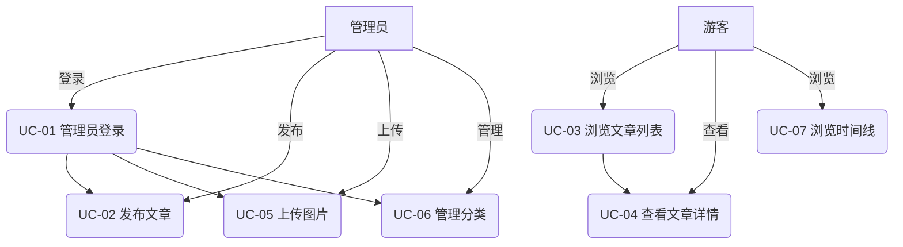
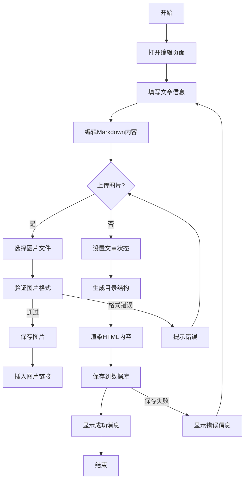
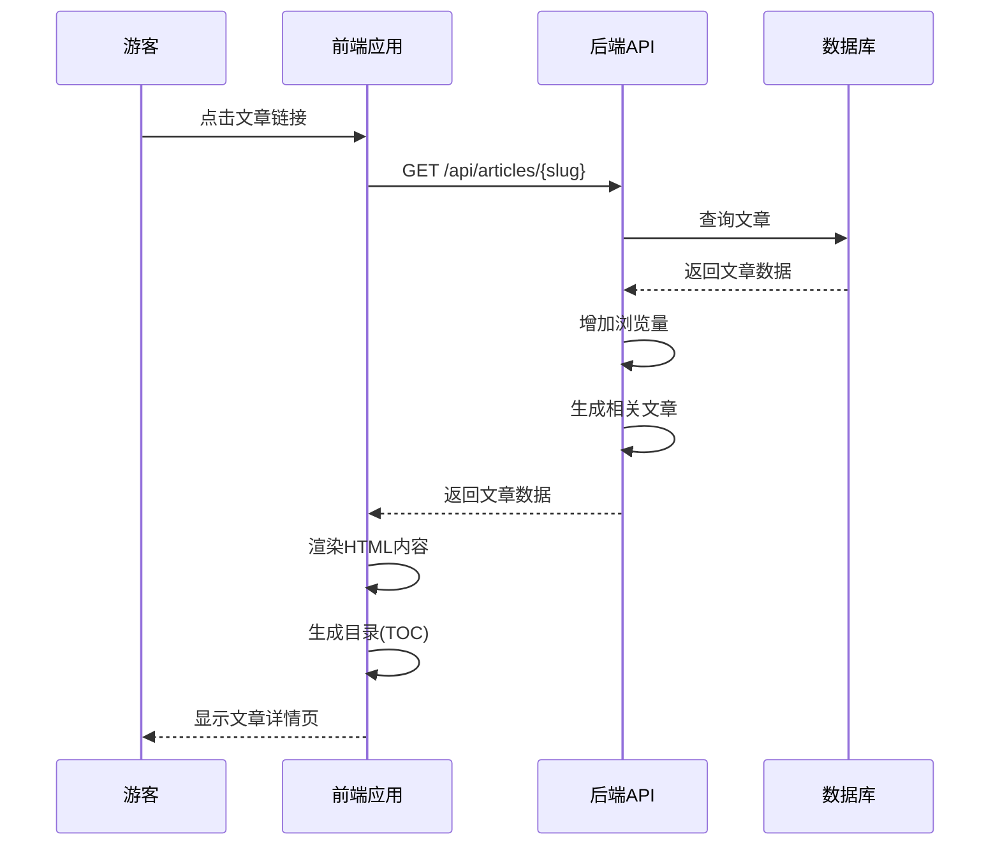
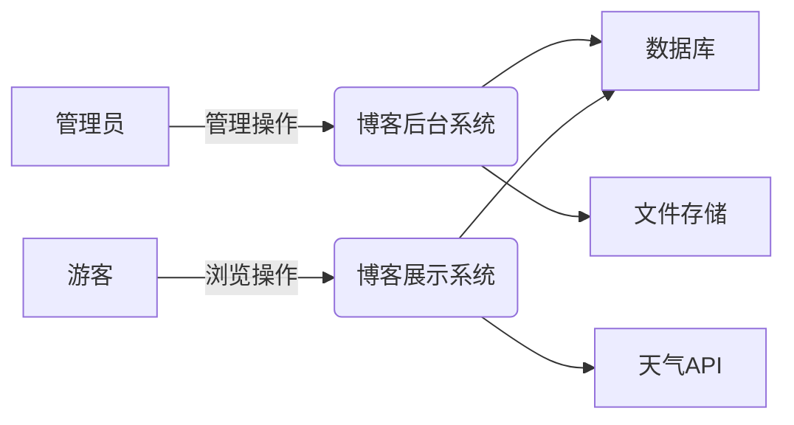

# 用例
## 个人博客系统用例分析

## 系统角色

1.  **管理员**：博主本人，拥有所有管理权限
2.  **游客**：访客，只能查看公开内容

## 核心用例列表

### 用例1：管理员登录

**用例编号**：UC-01  
**参与者**：管理员  
**用例描述**：管理员通过用户名和密码登录系统，获得管理权限  
**触发器**：管理员点击登录按钮  
**前置条件**：管理员拥有有效账号  
**后置条件**：登录成功则进入后台管理界面；失败则提示错误信息  
**基本事件流**：

1.  管理员访问登录页面
2.  输入用户名和密码
3.  系统验证凭证有效性
4.  系统创建认证会话
5.  重定向到后台管理仪表盘

**扩展事件流**：

*   A-1：如果用户名不存在，提示"用户名错误"
*   A-2：如果密码错误，提示"密码错误"
*   A-3：如果连续失败5次，锁定账号30分钟

**数据需求**：

*   D-1：用户名（4-20字符）
*   D-2：密码（8-20字符，含字母和数字）

**业务规则**：

*   B-1：管理员账号只能由系统初始化创建
*   B-2：密码使用bcrypt加密存储
*   B-3：会话有效期30分钟

* * *

### 用例2：发布文章

**用例编号**：UC-02  
**参与者**：管理员  
**用例描述**：管理员创建并发布新文章  
**触发器**：管理员点击"新建文章"按钮  
**前置条件**：管理员已登录  
**后置条件**：文章保存成功并发布到网站  
**基本事件流**：

1.  管理员进入文章编辑界面
2.  填写文章标题、分类、标签
3.  使用Markdown编辑器编写内容
4.  上传封面图片（可选）
5.  设置文章状态为"发布"
6.  系统验证必填字段
7.  系统渲染Markdown为HTML
8.  系统生成文章目录结构
9.  文章保存到数据库
10.  返回文章列表页

**扩展事件流**：

*   A-1：如果标题为空，提示"标题不能为空"
*   A-2：如果内容为空，提示"内容不能为空"
*   A-3：图片上传失败时保留其他内容

**数据需求**：

*   D-1：标题（5-200字符）
*   D-2：内容（Markdown格式）
*   D-3：分类（至少选择一个）
*   D-4：标签（可选，最多5个）
*   D-5：封面图片（JPEG/PNG，<5MB）

**业务规则**：

*   B-1：每篇文章必须有标题和内容
*   B-2：文章URL根据标题自动生成
*   B-3：发布时自动记录发布时间

* * *

### 用例3：浏览文章列表

**用例编号**：UC-03  
**参与者**：游客  
**用例描述**：游客查看博客文章列表  
**触发器**：访问博客首页  
**前置条件**：无  
**后置条件**：显示文章列表  
**基本事件流**：

1.  游客访问博客首页
2.  系统查询已发布的文章
3.  系统按发布时间倒序排列
4.  系统分页处理结果（每页10篇）
5.  渲染文章列表视图
6.  显示文章标题、摘要、发布时间等信息

**扩展事件流**：

*   A-1：如果无文章，显示"暂无内容"
*   A-2：如果网络延迟，显示加载动画

**数据需求**：

*   D-1：分页参数（页码）
*   D-2：筛选条件（分类/标签/关键词）

**业务规则**：

*   B-1：只显示已发布（published）状态的文章
*   B-2：列表按发布时间倒序排列
*   B-3：每篇文章显示浏览量

* * *

### 用例4：查看文章详情

**用例编号**：UC-04  
**参与者**：游客  
**用例描述**：游客查看单篇文章的完整内容  
**触发器**：点击文章标题或"阅读更多"链接  
**前置条件**：文章存在且已发布  
**后置条件**：显示文章完整内容  
**基本事件流**：

1.  游客访问文章详情页
2.  系统查询文章内容
3.  系统增加文章浏览量
4.  渲染文章HTML内容
5.  显示文章目录（桌面端）
6.  显示相关文章推荐

**扩展事件流**：

*   A-1：如果文章不存在，显示404页面
*   A-2：如果文章未发布，显示"内容不可用"

**数据需求**：

*   D-1：文章唯一标识符（slug或ID）

**业务规则**：

*   B-1：每次访问增加浏览量
*   B-2：移动端不显示目录
*   B-3：相关文章基于相同分类/标签

* * *

### 用例5：上传图片

**用例编号**：UC-05  
**参与者**：管理员  
**用例描述**：管理员上传图片用于文章内容  
**触发器**：在编辑器中点击图片上传按钮  
**前置条件**：管理员已登录  
**后置条件**：图片上传成功并返回URL  
**基本事件流**：

1.  管理员在编辑器中点击图片图标
2.  选择本地图片文件
3.  系统验证文件类型和大小
4.  系统生成唯一文件名
5.  保存图片到指定目录
6.  生成图片访问URL
7.  插入Markdown图片语法到编辑器

**扩展事件流**：

*   A-1：如果文件类型不支持，提示"仅支持JPG/PNG"
*   A-2：如果文件>5MB，提示"文件过大"
*   A-3：上传失败时保留编辑器内容

**数据需求**：

*   D-1：图片文件（JPEG/PNG/GIF）
*   D-2：文件大小限制（≤5MB）

**业务规则**：

*   B-1：文件名使用UUID避免冲突
*   B-2：图片存储在日期目录中
*   B-3：返回完整可访问URL

* * *

### 用例6：管理分类

**用例编号**：UC-06  
**参与者**：管理员  
**用例描述**：管理员创建和管理文章分类  
**触发器**：进入分类管理页面  
**前置条件**：管理员已登录  
**后置条件**：分类信息更新  
**基本事件流**：

1.  管理员进入分类管理界面
2.  查看现有分类列表
3.  可执行操作：添加/编辑/删除
4.  系统验证分类名称唯一性
5.  系统自动生成URL标识符
6.  保存分类信息

**扩展事件流**：

*   A-1：如果分类下有文章，禁止删除
*   A-2：如果名称重复，提示"分类已存在"

**数据需求**：

*   D-1：分类名称（2-50字符）
*   D-2：父分类（可选）
*   D-3：分类描述（可选）

**业务规则**：

*   B-1：分类名称必须唯一
*   B-2：删除分类需先移除关联文章
*   B-3：分类层级不超过3级

* * *

### 用例7：浏览时间线

**用例编号**：UC-07  
**参与者**：游客  
**用例描述**：游客按时间顺序查看文章  
**触发器**：点击"时间线"导航  
**前置条件**：无  
**后置条件**：显示按年月分组文章  
**基本事件流**：

1.  游客访问时间线页面
2.  系统查询所有已发布文章
3.  按年份和月份分组
4.  按时间倒序排列
5.  渲染时间线视图
6.  显示年份、月份和文章标题

**扩展事件流**：

*   A-1：如果无文章，显示提示信息
*   A-2：网络延迟时显示加载动画

**数据需求**：

*   D-1：分组参数（年/月）

**业务规则**：

*   B-1：只显示已发布文章
*   B-2：按发布时间倒序排列
*   B-3：年份按倒序排列

* * *

## 用例图

## 活动图（发布文章用例）

## 时序图（浏览文章详情）

## 补充用例列表

<figure class="table"><table><thead><tr><th>用例名称</th><th>参与者</th><th>描述</th></tr></thead><tbody><tr><td>编辑文章</td><td>管理员</td><td>修改已存在的文章内容</td></tr><tr><td>删除文章</td><td>管理员</td><td>将文章移至回收站或永久删除</td></tr><tr><td>管理标签</td><td>管理员</td><td>创建和管理文章标签</td></tr><tr><td>管理友链</td><td>管理员</td><td>添加/编辑/删除友情链接</td></tr><tr><td>更新站点设置</td><td>管理员</td><td>修改博客名称、座右铭等</td></tr><tr><td>浏览分类</td><td>游客</td><td>查看特定分类下的文章</td></tr><tr><td>浏览标签</td><td>游客</td><td>查看特定标签下的文章</td></tr><tr><td>浏览关于页面</td><td>游客</td><td>查看博主介绍信息</td></tr><tr><td>浏览友链页面</td><td>游客</td><td>查看友情链接列表</td></tr><tr><td>搜索文章</td><td>游客</td><td>根据关键词搜索文章</td></tr><tr><td>切换暗黑模式</td><td>游客</td><td>切换网站主题风格</td></tr><tr><td>控制音乐播放</td><td>游客</td><td>播放/暂停背景音乐</td></tr></tbody></table></figure>

## 系统边界

这个用例分析覆盖了个人博客系统的所有核心功能，包括管理员操作和游客浏览行为。每个用例都遵循标准格式，包含详细的触发条件、事件流和业务规则。用例图、活动图和时序图提供了不同角度的系统行为可视化，帮助理解各组件间的交互关系。